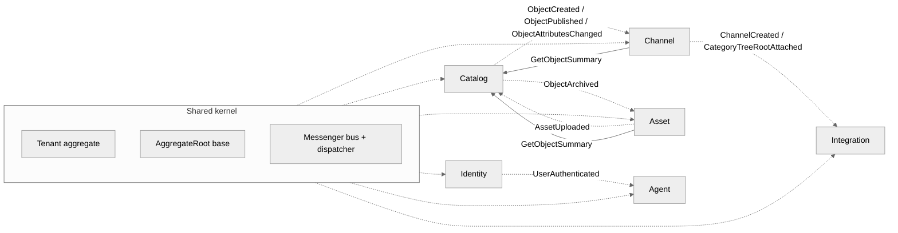

# Bounded Contexts and Cross-BC Communication

The dotted arrows are domain events emitted through `Shared\Domain\AggregateRoot::recordThat()` and dispatched by `Shared\Infrastructure\Messenger\DomainEventDispatcher` after every Doctrine flush. Solid arrows are synchronous query handlers used at validation time.

## Bounded Contexts

| BC | Status | Owns | Emits | Reads from |
|----|--------|------|-------|------------|
| Catalog | active | ObjectType, CatalogObject, Attribute, ObjectValue, Association, AssociationType, ObjectTypeAttribute | ObjectCreated, ObjectPublished, ObjectArchived, ObjectEnabledChanged, ObjectAttributesChanged | — |
| Channel | active | Channel, Locale, Currency, ChannelObjectTypeMapping | ChannelCreated, CategoryTreeRootAttached | Catalog (via `GetObjectSummary`) |
| Asset | active | Asset, AssetVariant | AssetUploaded, AssetVariantCreated | Catalog (via `GetObjectSummary` for the linked object) |
| Identity | active | User, Role, Permission, RefreshToken | UserAuthenticated, RefreshTokenRotated | Shared (Tenant context) |
| Shared | active | Tenant aggregate, AggregateRoot base, TenantContext, TenantFilter, AssignmentListener, RequestSubscriber, Messenger middleware | (no domain events) | (everything depends here) |
| Integration | scaffolded | (Faza 1: BaseLinker + Shopify channel adapters) | tbd | Catalog / Channel / Asset / Identity (Contracts only) |
| Agent | scaffolded | (Faza 2: Anthropic Claude tool runs + approval flow) | tbd | Catalog / Identity (Contracts only) |
| ApiConfigurator | scaffolded | (epic 0.10: per-integrator API profiles + key minting) | tbd | Catalog / Channel / Asset / Identity (Contracts only) |

## Ringfence rules (enforced by Deptrac — ADR-0013)

1. **Domain may not depend on Application or Infrastructure**, including its own BC's.
2. **Application may depend on its own BC's Domain + Contracts** + any other BC's `Contracts/` (events, query DTOs).
3. **Infrastructure** is the outer ring — may depend on the same BC's full stack + `Shared/{Domain,Application,Contracts}`.
4. **Contracts** is leaf — pure DTOs, no inward dependencies.
5. **Tooling** (Benchmark, DataFixtures, Story) may pull from any BC; nothing in a BC may pull from Tooling.

## Domain event flow

1. An aggregate method calls `$this->recordThat(new SomeEvent(...))`.
2. Doctrine commits the unit-of-work (`postFlush`).
3. `DomainEventDispatcher` walks the identity map, pulls events from every `AggregateRoot`, dispatches each through the default Messenger bus.
4. `IdempotencyMiddleware` (RF-20) drops duplicate redeliveries on async paths.
5. `#[AsMessageHandler]`-tagged subscribers — currently no-op stubs in `Catalog\Application\Subscriber\ObjectIndexedSubscriber` and `AssetLinkSubscriber` — pick the events up and act. Real reindex / publication logic lands in epic 0.5 (search) and the Integration BC (Faza 1).
