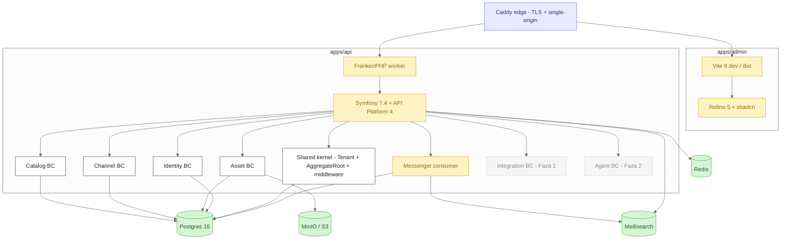

# C4 Container — Inside the PIM platform

**Caddy edge** terminates TLS, enforces the single-origin contract (`pim.localhost` for everything; no CORS), reverse-proxies `/api/*` to FrankenPHP and the rest to Vite (dev) or the SPA bundle (prod).

**FrankenPHP** runs the Symfony kernel in worker mode. `MAX_REQUESTS=1000` recycles the worker so PHP's known memory drift can't take the box down.

**Bounded contexts** live under `apps/api/src/`. Each carries its own `Domain / Application / Infrastructure / Contracts` ring — the cross-BC ringfence is enforced by Deptrac (ADR-0013).

**Messenger workers** consume the same Symfony Messenger bus the request thread uses. MVP routes everything synchronously; Faza 1 flips the Doctrine async DSN on without rewiring handlers.

**Storage**
- Postgres 16 — primary OLTP, JSONB + ltree, RLS pre-provisioned.
- Meilisearch — per-kind search indexes; reindexed by domain-event subscribers (epic 0.5).
- Redis — sessions, Messenger lock store, cache.app pool.
- MinIO / S3 — Asset binary storage via Flysystem; only Asset BC writes here.
