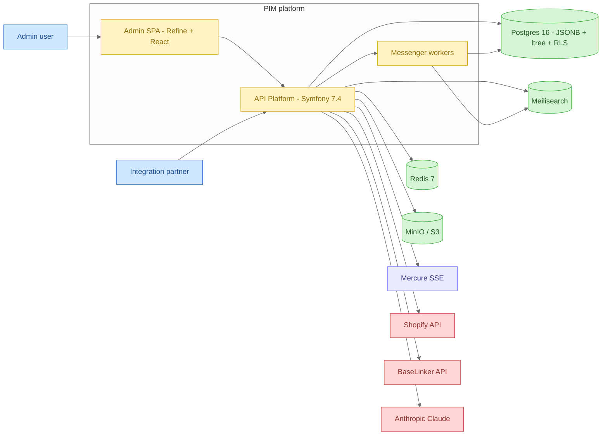

# C4 Context — PIM in its environment

**External actors**
- *Admin user* — runs the Refine SPA at `pim.localhost` / `pim.example.com`.
- *Integration partner* — calls `/api/*` directly with a per-tenant API key (epic 0.10 ApiConfigurator).

**Platform**
- *Admin SPA* — React 19 + Refine 5 + shadcn/ui served by Vite, single-origin behind Caddy.
- *API* — API Platform 4 on FrankenPHP worker mode. Hosts REST + GraphQL + JSON-LD, dispatches Messenger commands and domain events through the same bus.
- *Messenger workers* — sync transport in MVP, async (Doctrine queue) from Faza 1 — same bus, same handlers.

**Stores & infra**
- *Postgres 16* — every domain table carries `tenant_id`. RLS policies are pre-provisioned (epic 0.0.X), `ENABLE ROW LEVEL SECURITY` flips on at first multi-tenant deploy.
- *Meilisearch* — search index per kind (`products`, `categories`, `assets`).
- *Redis* — sessions + Messenger lock store + cache.
- *MinIO / S3* — Asset storage via Flysystem.
- *Mercure* — SSE channel for real-time admin updates (e.g. async indexing progress).

**External services**
- *Shopify API* — channel publisher (epic 0.9, deferred to Faza 1).
- *BaseLinker API* — channel publisher (epic 0.8, Faza 1).
- *Anthropic Claude API* — Agent layer (epic 0.7, Faza 2). Strict cost limits enforced by `Agent\Application\AgentRunBudgetEnforcer` (BC scaffolded, implementation in Faza 2).
